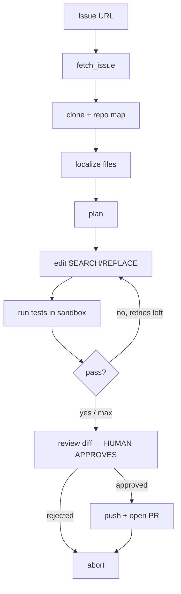

# PRForge 🔨

> An agentic PR bot that reads a GitHub issue, understands the codebase, writes a fix, runs the tests in a sandbox, and opens a **human-reviewed** pull request. Built as a GSoC 2026 co-pilot and an AI-engineering portfolio centerpiece.



## Why

- **For GSoC 2026:** point it at an org's issue → it reads the codebase, drafts a fix you review. Cuts ramp-up time and turns a 4-hour issue into a 30-minute reviewed PR.
- **For internships:** "I built a human-in-the-loop agentic coding agent with sandboxed execution, evaluated on SWE-bench" is a top-1% resume line.
- **For clubs:** AI Club / Open Source Club / GDG talk material.

It is a **co-pilot, not an autopilot** — every push passes a human approval gate. (GSoC mentors want to see *your* understanding, not spam PRs.)

## Install

```bash
git clone https://github.com/daksh1403/prforge.git
cd prforge
python -m venv .venv && source .venv/bin/activate
pip install -e '.[anthropic,dev]'      # or [openai] or [ollama]
cp .env.example .env                    # fill in your API key
```

## Configure

`.env` (one provider only):

```bash
PRFORGE_LLM_PROVIDER=anthropic          # anthropic | openai | ollama
ANTHROPIC_API_KEY=sk-ant-...
PRFORGE_MODEL=claude-sonnet-4-5-20250929
PRFORGE_MAX_ITERATIONS=3
PRFORGE_AUTO_APPROVE=false
```

For local/free runs with Ollama: `ollama pull qwen2.5-coder:7b`, set `PRFORGE_LLM_PROVIDER=ollama`.

## Usage

```bash
# fetch an issue (no LLM, no writes)
prforge fetch https://github.com/owner/repo/issues/42

# clone + map a repo (no LLM)
prforge map https://github.com/owner/repo.git

# solve end-to-end, dry run (local clone + diff, NO push, NO PR)
prforge solve https://github.com/owner/repo/issues/42 --dry-run

# inspect the generated diff
prforge diff https://github.com/owner/repo/issues/42

# go live: review the diff, approve, PR opens
prforge solve https://github.com/owner/repo/issues/42 --no-dry-run

# skip the gate (CI / batch) — use with care
prforge solve https://github.com/owner/repo/issues/42 --no-dry-run --yes
```

## The sandbox

Tests run inside a Docker container with **no network** and resource limits, so
the agent can't exfiltrate data or run wild. Build it once:

```bash
docker build -t prforge-sandbox:latest -f sandbox/Dockerfile .
```

If the image is missing, PRForge falls back to running tests locally (with a
warning) so you can still iterate.

## How it works

| Stage | What happens |
|-------|--------------|
| `fetch_issue` | `gh` CLI fetches the issue (falls back to the public API) |
| `clone_and_map` | shallow clone + a compact repo map (file tree + line counts) |
| `localize` | LLM picks the 2–6 most relevant files from the map |
| `plan` | LLM writes a concrete step-by-step plan |
| `edit` | LLM emits Aider-style `SEARCH/REPLACE` blocks; applied exactly |
| `test` | repo's test command runs in the sandbox |
| `review` | shows the `git diff`; **you** approve before anything is pushed |
| `push_and_pr` | branch → commit → push → `gh pr create` with an LLM-written body |

The loop retries `edit → test` up to `PRFORGE_MAX_ITERATIONS` times, feeding
test failures back to the LLM.

## More commands

```bash
# eval harness — no API key needed
prforge eval --self-test
# eval harness — real LLM over instances.jsonl
prforge eval eval/instances.jsonl
# batch solve many issues from a file
prforge batch issues.txt --dry-run
# run as an MCP server (tools for Claude Desktop / Cursor)
prforge mcp
# run the web dashboard
prforge dashboard
```

## Safety

| Risk | Mitigation |
|------|------------|
| Pushing broken code | human approval gate before every push |
| Dangerous shell | Docker sandbox, `--network none`, allowlisted commands |
| Spamming repos | `--dry-run` default, never auto-PR repos you don't own |
| Cost runaway | iteration cap + token truncation + local Ollama fallback |
| Secret leakage | your GitHub token never reaches the LLM; sandbox has no network |

## Project layout

```
prforge/
├── src/prforge/
│   ├── cli.py              # Typer + Rich CLI
│   ├── config.py           # env-driven config
│   ├── llm.py              # Anthropic / OpenAI / Ollama abstraction
│   ├── utils.py            # run(), json parsing, truncation
│   ├── agent/
│   │   ├── state.py        # LangGraph TypedDict
│   │   ├── prompts.py       # localize/plan/edit/PR prompts
│   │   ├── nodes.py         # the Agent class + node functions
│   │   └── graph.py         # the StateGraph wiring
│   └── tools/
│       ├── github.py        # gh CLI wrapper (fetch/branch/push/PR)
│       ├── codebase.py      # clone, repo map, read/grep, diff
│       ├── editor.py        # SEARCH/REPLACE parse + apply
│       └── sandbox.py       # Docker test runner (+ local fallback)
├── sandbox/Dockerfile
├── tests/                   # editor, codebase, github, utils
└── examples/
```

## Roadmap

- [x] Phase 0–1: fetch, clone, map, single/multi-file edit, dry-run diff
- [x] Phase 2: sandboxed tests + iterate-on-failure loop
- [x] Phase 3: human approval + auto open PR
- [x] Phase 4: SWE-bench-style eval harness + `--self-test` resolve rate
- [x] Phase 5: batch mode, MCP-server mode, React + FastAPI dashboard

## Evaluation

Run on [SWE-bench-lite](https://github.com/princeton-nlp/SWE-bench) (or a 20-issue subset) and record the resolve rate. Even 10–20% is a legitimate, citable result for a student project.

## References (study + contribute — these are GSoC orgs)

- [All-Hands-AI/OpenHands](https://github.com/All-Hands-AI/OpenHands) — open-source Devin
- [princeton-nlp/SWE-agent](https://github.com/princeton-nlp/SWE-agent) — agent + issue loop
- [Aider-AI/aider](https://github.com/Aider-AI/aider) — SEARCH/REPLACE + repo map
- [princeton-nlp/SWE-bench](https://github.com/princeton-nlp/SWE-bench) — the benchmark

## License

MIT © Daksh Agarwal
